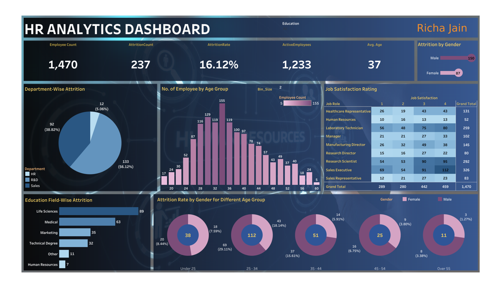

# HR Analytics Dashboard | Tableau

## Overview

Developed an interactive **HR Analytics Dashboard** in **Tableau** to analyze employee attrition, workforce demographics, job satisfaction, department performance, and workforce trends.

This project demonstrates how business intelligence dashboards can transform HR data into actionable insights, enabling organizations to monitor employee retention, understand workforce behavior, and support strategic decision-making.

### Key Skills

**Tableau • Dashboard Design • Data Visualization • HR Analytics • Business Intelligence • KPI Development • Workforce Analytics • Dashboard Storytelling**

---

# 📄 Project Deliverables

| Resource | What You'll Find |
|----------|------------------|
| 📂 [Tableau Workbook](https://github.com/Richa-Jain108/HR-Analytics-Dashboard-Tableau/blob/main/workbook/1.Richa%20Final%20Project.twbx) | Complete Tableau workbook containing all dashboard worksheets, calculations, visualizations, and dashboard design |
| 📄 [Dashboard Summary](https://github.com/Richa-Jain108/HR-Analytics-Dashboard-Tableau/blob/main/dashboard/HR_Analytics_Dashboard_Summary.pdf) | Executive-ready report explaining dashboard KPIs, business insights, and strategic HR recommendations |
| 📊 [Dashboard Preview](https://github.com/Richa-Jain108/HR-Analytics-Dashboard-Tableau/blob/main/images/dashboard-overview.PNG) | High-resolution preview of the final interactive HR Analytics Dashboard |
| 📁 [Dataset](https://github.com/Richa-Jain108/HR-Analytics-Dashboard-Tableau/blob/main/data/HR%20Data.xlsx) | Employee dataset used to build the dashboard and perform workforce analysis |

---

# Business Problem

Employee attrition is one of the most significant challenges faced by organizations, directly impacting recruitment costs, employee productivity, business continuity, and organizational performance.

The objective of this project was to design an interactive HR Analytics Dashboard that enables HR teams and business leaders to:

- Monitor workforce KPIs
- Identify employee attrition patterns
- Analyze workforce demographics
- Compare job satisfaction across job roles
- Understand department-level attrition trends
- Support strategic workforce planning through data-driven insights

---

# Dataset Overview

### Workforce Summary

- **1,470 Employees**
- **237 Employees Left**
- **1,233 Active Employees**
- **16.12% Attrition Rate**
- **37 Years Average Employee Age**

### Dataset Includes

- Employee Demographics
- Department Information
- Education Background
- Job Roles
- Attrition Status
- Job Satisfaction
- Workforce Age
- Gender Distribution

---

# Dashboard Preview



---

# Dashboard Features

The dashboard provides interactive analysis across multiple HR dimensions:

- Workforce KPIs
- Employee Attrition Analysis
- Department-wise Attrition
- Employee Age Distribution
- Education Field Analysis
- Gender-wise Attrition
- Job Satisfaction by Job Role
- Workforce Demographics

---

# Key Business Insights

## Workforce Overview

- The organization consists of **1,470 employees**, with **237 employees** having left the company.
- The overall employee attrition rate stands at **16.12%**, indicating opportunities to strengthen employee retention initiatives.

---

## Department-wise Attrition

- **Research & Development** records the highest employee attrition.
- **Sales** is the second-largest contributor to employee turnover.
- **Human Resources** experiences the lowest attrition.

These findings indicate that retention initiatives should primarily focus on customer-facing and technical departments.

---

## Workforce Demographics

- The majority of employees belong to the **25–34 years** age group.
- The average employee age is **37 years**.
- Workforce composition gradually declines across higher age groups.

---

## Gender Analysis

- Male employees account for a larger proportion of employee attrition than female employees.
- Gender-based workforce trends provide additional context for targeted engagement strategies.

---

## Education Analysis

Employee attrition is highest among employees from:

- Life Sciences
- Medical
- Marketing
- Technical Degree

These insights help HR teams identify workforce segments requiring additional retention efforts.

---

## Job Satisfaction

The dashboard compares employee job satisfaction across multiple job roles, enabling HR leaders to:

- Monitor employee engagement
- Compare satisfaction across roles
- Support retention planning
- Identify opportunities for improving employee experience

---

# Business Recommendations

- Strengthen retention initiatives within Research & Development and Sales departments.
- Improve employee engagement and career progression programs for early- and mid-career professionals.
- Regularly monitor job satisfaction metrics to proactively address employee concerns.
- Use workforce demographics to improve succession planning and talent acquisition strategies.
- Extend the solution with predictive HR analytics to identify employees at high risk of attrition.

---

# Tools & Technologies

**Tableau Desktop • Microsoft Excel • Data Visualization • Dashboard Design • HR Analytics • Business Intelligence • KPI Development**

---

# Repository Structure

```text
HR-Analytics-Dashboard-Tableau/
│
├── README.md
│
├── data/
│   └── HR Data.xlsx
│
├── dashboard/
│   └── HR_Analytics_Dashboard_Summary.pdf
│
├── images/
│   └── dashboard-overview.PNG
│
├── workbook/
│   └── 1.Richa Final Project.twbx
│
├── requirements.txt
│
└── .gitignore
```

---

# Skills Demonstrated

✔ Interactive Tableau Dashboard Development

✔ Executive KPI Dashboard Design

✔ HR Analytics

✔ Workforce Analytics

✔ Employee Attrition Analysis

✔ Dashboard Storytelling

✔ Business Intelligence

✔ Data Visualization

✔ Workforce Demographic Analysis

✔ Business Recommendation Development

✔ Executive Reporting

---

# Author

**Richa Jain**

**Data Analytics | SQL | Python | Tableau | Business Intelligence | Data Visualization**
